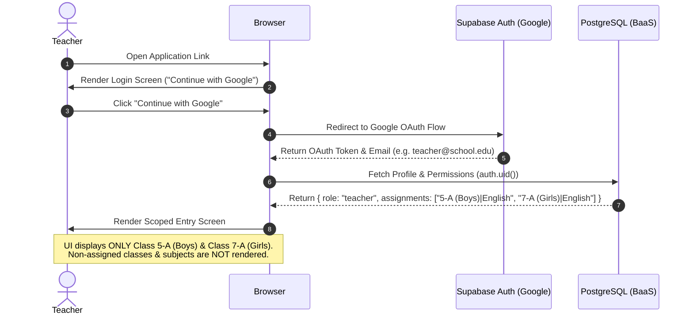
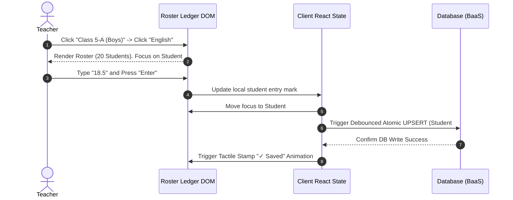
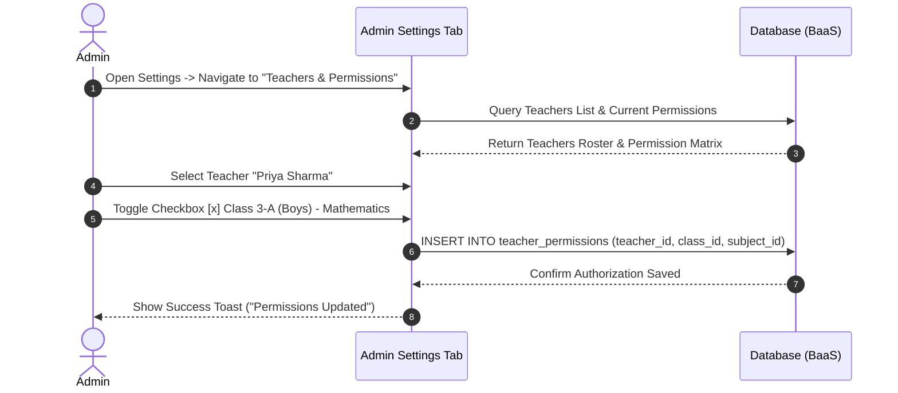
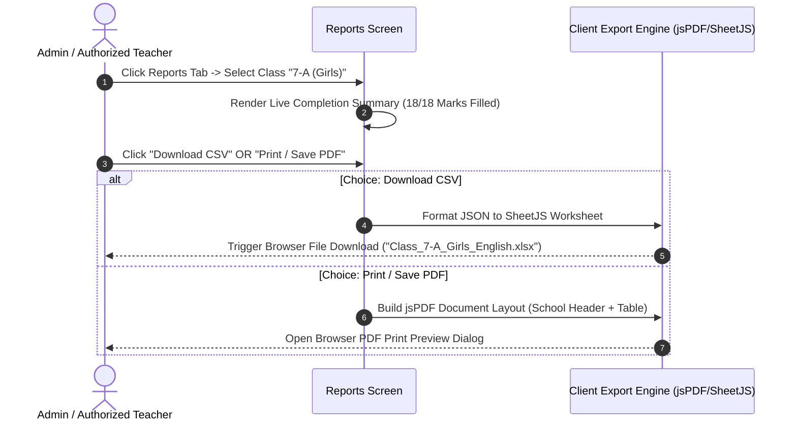
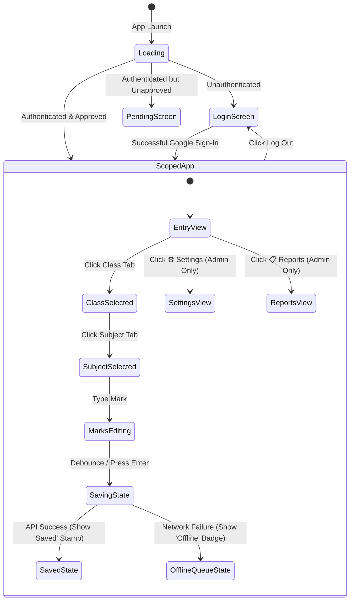

# App Flow & User Journeys — The Register

**Project Name:** The Register — Formative Assessment Marking Platform  
**Document Version:** 1.0.0  
**Focus:** User Navigation Architecture, Interaction Flows, State Machines & Screen Maps  

---

## 1. High-Level Site Map & Navigation Hierarchy

```
/
├── /login                            [Google Sign-In Authentication]
├── /pending                          [Account Pending Admin Approval]
├── /app (Authenticated Root)
│   ├── /app/entry                    [Teacher & Admin: Scoped Marks Entry Ledger]
│   │   ├── Step 1: Select Assigned Class (Filtered)
│   │   ├── Step 2: Select Assigned Subject (Filtered)
│   │   └── Step 3: Enter Marks Roster (Keyboard Navigation)
│   ├── /app/reports                  [Admin & Authorized Teacher: Class & Student Reports]
│   │   ├── Overview Progress Grid
│   │   ├── Class & Subject Drilldown Ledger
│   │   └── Export Actions (Download CSV / Print & Save PDF)
│   └── /app/settings                 [Admin Only: Roster & Permission Controls]
│       ├── Class & Subject Master List
│       ├── Bulk Roster Import (Paste Roll, Name)
│       └── Teacher Assignment Permission Matrix
```

---

## 2. Comprehensive User Journeys

### 2.1 Journey 1: Teacher Login & Zero-Noise Class Scoping



---

### 2.2 Journey 2: Frictionless Marks Entry & Keyboard Velocity Loop



---

### 2.3 Journey 3: Admin Managing Teacher Subject Assignments



---

### 2.4 Journey 4: Class & Student Report Generation & Download (PDF/CSV)



---

## 3. Application State Machine Definitions


