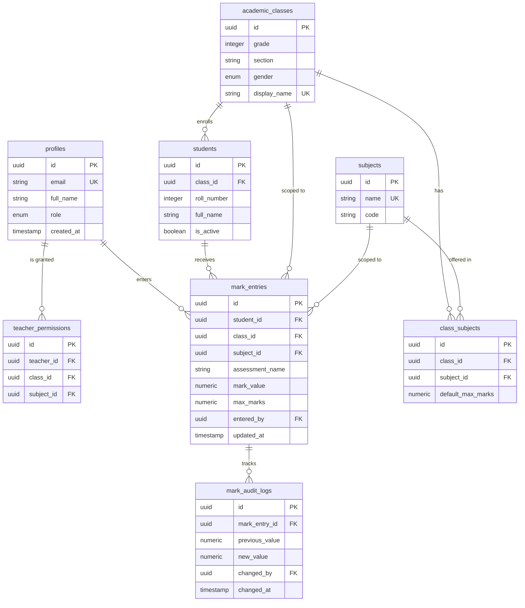

# Backend Schema & Security Rules — The Register

**Project Name:** The Register — Formative Assessment Marking Platform  
**Document Version:** 1.0.0  
**Database Target:** PostgreSQL 15+ (Supabase BaaS) / Firestore Rules (Firebase BaaS)  

---

## 1. Relational Entity Relationship Diagram (ERD)



---

## 2. Complete PostgreSQL Database DDL Script

```sql
-- Enable UUID extension
CREATE EXTENSION IF NOT EXISTS "uuid-ossp";

-- 1. Create Enums
CREATE TYPE user_role AS ENUM ('admin', 'teacher');
CREATE TYPE gender_group AS ENUM ('boys', 'girls', 'coed');

-- 2. Profiles Table (Linked to Auth.Users)
CREATE TABLE profiles (
    id UUID PRIMARY KEY REFERENCES auth.users(id) ON DELETE CASCADE,
    email TEXT UNIQUE NOT NULL,
    full_name TEXT NOT NULL,
    role user_role DEFAULT 'teacher',
    created_at TIMESTAMPTZ DEFAULT NOW()
);

-- 3. Academic Classes Table
CREATE TABLE academic_classes (
    id UUID PRIMARY KEY DEFAULT gen_random_uuid(),
    grade INTEGER NOT NULL CHECK (grade BETWEEN 1 AND 12),
    section VARCHAR(5) NOT NULL,
    gender gender_group NOT NULL DEFAULT 'boys',
    display_name TEXT UNIQUE NOT NULL, -- e.g. "1-A (Boys)"
    created_at TIMESTAMPTZ DEFAULT NOW()
);

-- 4. Subjects Table
CREATE TABLE subjects (
    id UUID PRIMARY KEY DEFAULT gen_random_uuid(),
    name TEXT UNIQUE NOT NULL,
    code VARCHAR(20)
);

-- 5. Class Subjects Assignment (Max Marks Config)
CREATE TABLE class_subjects (
    id UUID PRIMARY KEY DEFAULT gen_random_uuid(),
    class_id UUID REFERENCES academic_classes(id) ON DELETE CASCADE,
    subject_id UUID REFERENCES subjects(id) ON DELETE CASCADE,
    default_max_marks NUMERIC(5,2) DEFAULT 100.00,
    CONSTRAINT unique_class_subject UNIQUE(class_id, subject_id)
);

-- 6. Students Table
CREATE TABLE students (
    id UUID PRIMARY KEY DEFAULT gen_random_uuid(),
    class_id UUID REFERENCES academic_classes(id) ON DELETE CASCADE,
    roll_number INTEGER NOT NULL,
    full_name TEXT NOT NULL,
    is_active BOOLEAN DEFAULT TRUE,
    created_at TIMESTAMPTZ DEFAULT NOW(),
    CONSTRAINT unique_class_roll UNIQUE(class_id, roll_number)
);

-- 7. Teacher Access Permissions (Granular Scope)
CREATE TABLE teacher_permissions (
    id UUID PRIMARY KEY DEFAULT gen_random_uuid(),
    teacher_id UUID REFERENCES profiles(id) ON DELETE CASCADE,
    class_id UUID REFERENCES academic_classes(id) ON DELETE CASCADE,
    subject_id UUID REFERENCES subjects(id) ON DELETE CASCADE,
    CONSTRAINT unique_teacher_assignment UNIQUE(teacher_id, class_id, subject_id)
);

-- 8. Mark Entries Table (Atomic Row Entries)
CREATE TABLE mark_entries (
    id UUID PRIMARY KEY DEFAULT gen_random_uuid(),
    student_id UUID REFERENCES students(id) ON DELETE CASCADE,
    class_id UUID REFERENCES academic_classes(id) ON DELETE CASCADE,
    subject_id UUID REFERENCES subjects(id) ON DELETE CASCADE,
    assessment_name TEXT DEFAULT 'Formative Assessment 1',
    mark_value NUMERIC(5,2) CHECK (mark_value >= 0),
    max_marks NUMERIC(5,2) DEFAULT 100.00 CHECK (max_marks > 0),
    entered_by UUID REFERENCES profiles(id) ON DELETE SET NULL,
    created_at TIMESTAMPTZ DEFAULT NOW(),
    updated_at TIMESTAMPTZ DEFAULT NOW(),
    CONSTRAINT unique_student_assessment UNIQUE(student_id, subject_id, assessment_name)
);

-- 9. Immutable Audit History Logs
CREATE TABLE mark_audit_logs (
    id UUID PRIMARY KEY DEFAULT gen_random_uuid(),
    mark_entry_id UUID REFERENCES mark_entries(id) ON DELETE CASCADE,
    previous_value NUMERIC(5,2),
    new_value NUMERIC(5,2),
    changed_by UUID REFERENCES profiles(id) ON DELETE SET NULL,
    changed_at TIMESTAMPTZ DEFAULT NOW()
);

-- Performance Indexes
CREATE INDEX idx_students_class ON students(class_id);
CREATE INDEX idx_teacher_perm_teacher ON teacher_permissions(teacher_id);
CREATE INDEX idx_mark_entries_class_subject ON mark_entries(class_id, subject_id);
```

---

## 3. Server-Side Row Level Security (RLS) Rules Definitions

```sql
-- Enable RLS on all critical tables
ALTER TABLE profiles ENABLE ROW LEVEL SECURITY;
ALTER TABLE academic_classes ENABLE ROW LEVEL SECURITY;
ALTER TABLE subjects ENABLE ROW LEVEL SECURITY;
ALTER TABLE students ENABLE ROW LEVEL SECURITY;
ALTER TABLE teacher_permissions ENABLE ROW LEVEL SECURITY;
ALTER TABLE mark_entries ENABLE ROW LEVEL SECURITY;

-- --------------------------------------------------
-- RLS POLICIES FOR MARK ENTRIES
-- --------------------------------------------------

-- 1. Admins: Full Access
CREATE POLICY admin_full_access_marks ON mark_entries
    FOR ALL TO authenticated
    USING (EXISTS (SELECT 1 FROM profiles WHERE id = auth.uid() AND role = 'admin'));

-- 2. Teachers: SELECT Scoped Marks Only
CREATE POLICY teacher_select_scoped_marks ON mark_entries
    FOR SELECT TO authenticated
    USING (
        EXISTS (
            SELECT 1 FROM teacher_permissions tp
            WHERE tp.teacher_id = auth.uid()
            AND tp.class_id = mark_entries.class_id
            AND tp.subject_id = mark_entries.subject_id
        )
    );

-- 3. Teachers: INSERT / UPDATE Scoped Marks Only
CREATE POLICY teacher_write_scoped_marks ON mark_entries
    FOR INSERT WITH CHECK (
        EXISTS (
            SELECT 1 FROM teacher_permissions tp
            WHERE tp.teacher_id = auth.uid()
            AND tp.class_id = mark_entries.class_id
            AND tp.subject_id = mark_entries.subject_id
        )
    );

-- --------------------------------------------------
-- RLS POLICIES FOR CLASS & SUBJECT READ ACCESS
-- --------------------------------------------------

-- Teachers only see classes assigned to them in teacher_permissions
CREATE POLICY teacher_read_assigned_classes ON academic_classes
    FOR SELECT TO authenticated
    USING (
        EXISTS (SELECT 1 FROM profiles WHERE id = auth.uid() AND role = 'admin') OR
        EXISTS (
            SELECT 1 FROM teacher_permissions tp
            WHERE tp.teacher_id = auth.uid() AND tp.class_id = academic_classes.id
        )
    );
```

---

## 4. Alternative Firebase Firestore Security Rules Equivalent

In the event Firebase is selected as the cloud BaaS provider:

```javascript
rules_version = '2';
service cloud.firestore {
  match /databases/{database}/documents {

    function isAdmin() {
      return request.auth != null && 
        get(/databases/$(database)/documents/profiles/$(request.auth.uid)).data.role == 'admin';
    }

    function isAssigned(classId, subjectId) {
      return request.auth != null && 
        exists(/databases/$(database)/documents/teacher_permissions/$(request.auth.uid + '_' + classId + '_' + subjectId));
    }

    match /mark_entries/{entryId} {
      allow read: if isAdmin() || isAssigned(resource.data.classId, resource.data.subjectId);
      allow write: if isAdmin() || isAssigned(request.resource.data.classId, request.resource.data.subjectId);
    }

    match /profiles/{userId} {
      allow read: if request.auth != null;
      allow write: if isAdmin();
    }
  }
}
```
