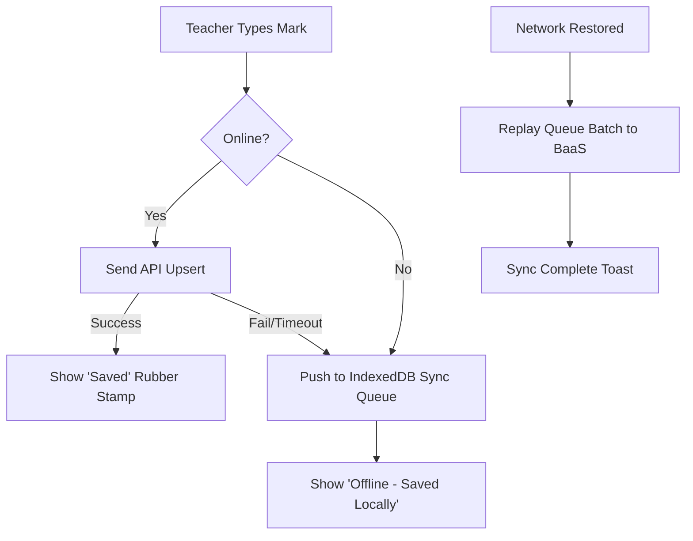

# Technical Requirements Document (TRD) — The Register

**Project Name:** The Register — Formative Assessment Marking Platform  
**Document Version:** 1.0.0  
**Target Platform:** Web (Vite + React / Next.js SPA)  
**Backend Infrastructure:** Supabase (PostgreSQL BaaS) / Firebase (Firestore BaaS) — Free Tier  
**Hosting Infrastructure:** Vercel / Netlify Edge CDN — Free Tier  

---

## 1. System Architecture Overview

The system is engineered as a decoupled, serverless Jamstack application leveraging Cloud Native BaaS (Backend-as-a-Service) to achieve zero hosting cost, instant scalability, and sub-100ms response times.

```mermaid
graph TD
    Client[Browser: React SPA PWA] -->|Auth: OAuth 2.0| AuthModule[Google OAuth Provider]
    Client -->|API / WebSockets| BaaS[Supabase BaaS / Firebase BaaS]
    BaaS --> RLS Engine[Server-Side Row Level Security Engine]
    RLS Engine --> DB[(PostgreSQL Database)]
    Client -->|Local Backup Sync| LocalQueue[(IndexedDB Offline Queue)]
    Client -->|Generate PDF/CSV| ClientExport[jsPDF + SheetJS Engine]
```

---

## 2. Tech Stack Breakdown

| Component | Selected Technology | Alternative Considered | Justification |
| :--- | :--- | :--- | :--- |
| **Frontend Framework** | React 19 (Vite / Next.js App Router) | Vanilla JS | Component modularity, state reactivity, zero bundle bloat with Vite. |
| **Styling Engine** | Vanilla CSS Tokens + CSS Modules / Tailwind | Plain inline styles | Maximum design flexibility, high-density paper ledger tokens (`Fraunces` + `IBM Plex`). |
| **Authentication** | Google OAuth 2.0 via Supabase Auth | Custom JWT / Passwords | Passwordless security, institutional domain verification, zero credential storage risk. |
| **Database** | PostgreSQL (Supabase Free Tier) | Firebase Firestore | Relational integrity, atomic UPSERT queries, robust SQL Row-Level Security (RLS). |
| **Realtime Engine** | Supabase Realtime (WebSockets) | Firebase Listeners | Instant sync across concurrent teacher tabs without polling. |
| **Reporting / Export** | `jsPDF` + `html2canvas` & `SheetJS (xlsx)` | Server-side PDF rendering | 100% client-side generation, zero server memory overhead, works offline. |
| **Hosting & CDN** | Vercel / Netlify | AWS S3 / Cloudflare Pages | Free SSL, instant git deployment pipelines, sub-30ms edge routing. |

---

## 3. Detailed Technical Requirements

### 3.1 Authentication & Domain Validation Engine
* **Protocol**: OAuth 2.0 PKCE Flow via Supabase Auth (`supabase.auth.signInWithOAuth({ provider: 'google' })`).
* **Session Persistence**: JWT stored in `localStorage` / HTTP-only Secure Cookies.
* **Domain Restrictions**: Support for restricts to `@msb.edu` / institutional domain.
* **User Provisioning Hook**: Database trigger (`on_auth_user_created`) inserts a baseline profile record into `profiles` with role `'teacher'`.

### 3.2 Backend Security & Server-Side Enforcement (Row Level Security - RLS)
All data queries MUST execute under RLS policy rules. The client CANNOT bypass teacher assignments even if raw SQL queries are sent directly.

```sql
-- Security Policy Enforcement for Teacher Mark Writes
CREATE POLICY teacher_write_marks ON mark_entries
    FOR ALL TO authenticated
    USING (
        EXISTS (
            SELECT 1 FROM profiles p WHERE p.id = auth.uid() AND p.role = 'admin'
        ) OR EXISTS (
            SELECT 1 FROM teacher_permissions tp
            WHERE tp.teacher_id = auth.uid()
            AND tp.class_id = mark_entries.class_id
            AND tp.subject_id = mark_entries.subject_id
        )
    );
```

### 3.3 Dynamic Marking Ledger Engine & Auto-Save Specs
* **Input Parsing**: Accept numbers and decimals (e.g. `14.5`, `18`). Strip invalid alpha characters via `inputmode="decimal"`.
* **Atomic Upsert Query**:
  ```sql
  INSERT INTO mark_entries (student_id, class_id, subject_id, assessment_name, mark_value, max_marks, entered_by)
  VALUES ($1, $2, $3, $4, $5, $6, auth.uid())
  ON CONFLICT (student_id, subject_id, assessment_name)
  DO UPDATE SET 
      mark_value = EXCLUDED.mark_value,
      max_marks = EXCLUDED.max_marks,
      entered_by = EXCLUDED.entered_by,
      updated_at = NOW();
  ```
* **Debounce Strategy**: Auto-save triggers 400ms after user stops typing, or instantly when `Enter` key or `Tab` key is pressed.

### 3.4 Report Generation Engine Architecture
1. **CSV/Excel Export Engine**:
   - Uses `SheetJS` to transform JSON roster state into clean `.xlsx` / `.csv` blobs.
   - Headers: `Roll Number`, `Student Name`, `Class`, `Subject`, `Marks Obtained`, `Max Marks`, `Percentage`, `Last Updated By`, `Timestamp`.
2. **PDF Export Engine**:
   - Uses `jsPDF` + `jspdf-autotable` to assemble clean vector PDF reports with institutional header, class metadata, summary statistics (Class Average, Highest Mark, Pass Rate), and printable signature lines.

---

## 4. Performance & Hardware Benchmarks

* **FPS Target**: 60 FPS scrolling on rosters containing 100+ students.
* **Bundle Size Limit**: Main JS bundle size < 180 KB gzipped.
* **Network Bandwidth**: Mark save payload < 1.5 KB per request.
* **Memory Footprint**: Client browser RAM usage < 45 MB.

---

## 5. Error Handling & Offline Fallback Architecture


