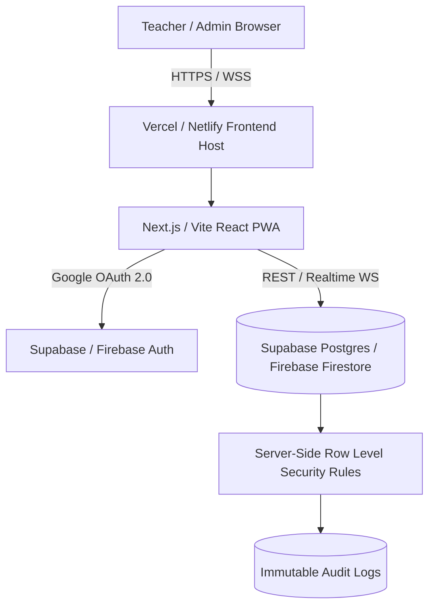

# System Design, Domain Context & Re-creation Roadmap: The Register

**Document Version:** 1.0.0  
**Project:** The Register — Formative Assessment Marking Platform  
**Target Architecture:** Modern Full-Stack (Free Tier Cloud Native - Supabase / Firebase + Next.js / Vite)

---

> [!NOTE]
> This document summarizes the complete analysis of the existing codebase, domain context, business logic, system architecture, security risks, and the step-by-step blueprint for a full modern front-end and back-end recreation.

---

## 1. Executive Summary & Core Purpose

**The Register** is a specialized, high-efficiency formative assessment marking platform designed for school educators (specifically tailored for an MSB / Bohra community school context with 27 distinct classes, 550+ students, and gender-divided sections *Talabat / Talebaat*).

### Primary Problem Solved
Traditional school ERP systems are bloated, slow, and require multiple clicks, page reloads, and navigation menus to input student marks. **The Register** provides a paper-register-like digital ledger where:
1. Teachers log in using secure credentials / Google Sign-In.
2. Teachers select their assigned Class and Subject.
3. A pre-filled student roster appears instantly.
4. Teachers type marks with **keyboard-first navigation** (`Enter` key jumps to the next student) and **auto-saving**, eliminating manual save button friction.
5. School Admins retain centralized control over rosters, max marks, teacher subject assignments, audit trails (who entered what and when), and PDF/CSV report generation.

---

## 2. Comprehensive Domain Context & Dataset Analysis

### A. Academic Structure & Classification
- **Grades Covered**: Standard 1 through Standard 7.
- **Section & Gender Division**: Each grade is divided into sections (`A`, `B`, `C`) and further split by gender group:
  - **Boys** (*Talabat*)
  - **Girls** (*Talebaat*)
- **Total Active Classes**: **27 distinct class rosters** (e.g., `1-A (Boys)`, `1-A (Girls)`, `1-B (Boys)`, `1-B (Girls)`, ... `7-A (Girls)`).

### B. Curricular Rules & Subject Mapping
The platform enforces strict subject groupings based on Grade level:
| Grade Level | Assigned Subjects | Default Max Marks |
| :--- | :--- | :--- |
| **Classes 1 – 4** (Primary) | Maths, Science, Physics, Chemistry, Biology, History, Geography | 100 (Customizable per exam: 15, 20, 25, 50, etc.) |
| **Classes 5 – 7** (Middle/Higher) | Sociology, Economics, Business Studies | 100 (Customizable per exam) |

### C. Seed Roster Analysis
- **Student Count**: 550+ pre-seeded student records across 27 classes.
- **Naming System**: Traditional Bohra community naming convention with honorifics (`bhai`, `bai`, `bs`, `bn`, `Mulla`, `Shaikh`, `Shz`).
- **Student Identifier**: Roll / Register number (e.g., `28903`) + Unique ID (`st_28903`).

---

## 3. Critical Analysis of Existing Codebase (`register.html`)

### A. Strengths & High-Value Features
1. **Exceptional UI Aesthetics & UX**:
   - Tactile "Paper Ledger" design system (`--paper: #EEF3E8`, `--card: #FBFBF6`, serif headers `Fraunces`, monospace data `IBM Plex Mono`).
   - Animated visual save feedback (`✓ Saved` rubber-stamp animation).
   - Zero-friction keyboard flow (`Enter` key listener moves focus down `.marks-input` list).
2. **Pre-Seeded Roster Configuration**:
   - Out-of-the-box readiness with full school seed data embedded directly.
3. **Granular Teacher Assignment UI**:
   - Interface for Admin to check/uncheck exact Class + Subject permissions per teacher.

### B. Security Vulnerabilities & Structural Flaws
> [!WARNING]
> The current single-file HTML implementation (`register.html`) has major technical debt and security vulnerabilities that prevent production deployment without a real backend.

1. **Broken Persistence Outside Claude Sandbox**:
   - Uses `window.storage.get()` and `window.storage.set()`, an API proprietary to Anthropic's Claude Artifact preview. When hosted on Netlify, Vercel, or opened directly in a browser, `window.storage` is undefined, causing total storage failure.
2. **Client-Side Security Flaws**:
   - Passwords and admin status are stored in plain client-side storage.
   - Access control (teacher subject restrictions) is performed only via UI JS conditionals (`if (isAdmin()) ...`). Any user opening browser Developer Tools can view all student marks or modify state directly.
3. **Monolithic Data Blob & Race Conditions**:
   - All marks across all 27 classes and subjects are stored in a single JSON key (`marks`).
   - Every time a teacher saves a mark, the entire dictionary is overwritten (`sset('marks', state.marks)`).
   - **Race Condition Hazard**: If Teacher A (Class 1 Maths) and Teacher B (Class 5 Eco) type marks at the same time, the last save will completely overwrite and erase the other teacher's entries!
4. **Lack of Server-Side Audit Verification**:
   - Audit trail timestamp (`at`) and `enteredByName` are client-generated and untrusted.

---

## 4. Re-creation System Architecture ("The Brain Part")

To transform this prototype into an elite, secure, multi-user production system using **100% Free Hosting Services**, we design a decoupled architecture.



### A. Free Tier Tech Stack Selection
- **Frontend Hosting**: **Vercel** or **Netlify** (Free tier: Unlimited builds, global CDN, SSL).
- **Backend & Database Options**:
  - **Option 1 (Recommended): Supabase**
    - Free Tier: 500 MB Postgres Database, 50k monthly active users, Google OAuth, Row Level Security (RLS), Realtime WebSockets.
  - **Option 2: Firebase**
    - Free Spark Tier: 1 GB Firestore DB, 50,000 reads/day, 20,000 writes/day, Google Auth, Firestore Security Rules.

---

## 5. Normalized Relational Data Model Schema (PostgreSQL / Supabase)

```sql
-- 1. Roles Enum
CREATE TYPE user_role AS ENUM ('admin', 'teacher');
CREATE TYPE gender_group AS ENUM ('boys', 'girls', 'coed');

-- 2. Users / Teachers Profile Table
CREATE TABLE profiles (
    id UUID PRIMARY KEY REFERENCES auth.users(id) ON DELETE CASCADE,
    email TEXT UNIQUE NOT NULL,
    full_name TEXT NOT NULL,
    role user_role DEFAULT 'teacher',
    created_at TIMESTAMPTZ DEFAULT NOW()
);

-- 3. Academic Classes Table
CREATE TABLE academic_classes (
    id UUID PRIMARY KEY DEFAULT gen_random_uuid(),
    grade INTEGER NOT NULL CHECK (grade BETWEEN 1 AND 12),
    section VARCHAR(5) NOT NULL,
    gender gender_group NOT NULL,
    display_name TEXT UNIQUE NOT NULL, -- e.g. "1-A (Boys)"
    created_at TIMESTAMPTZ DEFAULT NOW()
);

-- 4. Subjects Table
CREATE TABLE subjects (
    id UUID PRIMARY KEY DEFAULT gen_random_uuid(),
    name TEXT NOT NULL UNIQUE,
    code VARCHAR(20)
);

-- 5. Class-Subject Assignments & Max Marks
CREATE TABLE class_subjects (
    id UUID PRIMARY KEY DEFAULT gen_random_uuid(),
    class_id UUID REFERENCES academic_classes(id) ON DELETE CASCADE,
    subject_id UUID REFERENCES subjects(id) ON DELETE CASCADE,
    default_max_marks NUMERIC(5,2) DEFAULT 100.00,
    UNIQUE(class_id, subject_id)
);

-- 6. Students Table
CREATE TABLE students (
    id UUID PRIMARY KEY DEFAULT gen_random_uuid(),
    class_id UUID REFERENCES academic_classes(id) ON DELETE CASCADE,
    roll_number INTEGER NOT NULL,
    full_name TEXT NOT NULL,
    is_active BOOLEAN DEFAULT TRUE,
    created_at TIMESTAMPTZ DEFAULT NOW(),
    UNIQUE(class_id, roll_number)
);

-- 7. Teacher Access Permissions (Granular Control)
CREATE TABLE teacher_permissions (
    id UUID PRIMARY KEY DEFAULT gen_random_uuid(),
    teacher_id UUID REFERENCES profiles(id) ON DELETE CASCADE,
    class_id UUID REFERENCES academic_classes(id) ON DELETE CASCADE,
    subject_id UUID REFERENCES subjects(id) ON DELETE CASCADE,
    UNIQUE(teacher_id, class_id, subject_id)
);

-- 8. Mark Entries Table (Atomic Row per Student x Subject x Assessment)
CREATE TABLE mark_entries (
    id UUID PRIMARY KEY DEFAULT gen_random_uuid(),
    student_id UUID REFERENCES students(id) ON DELETE CASCADE,
    class_id UUID REFERENCES academic_classes(id) ON DELETE CASCADE,
    subject_id UUID REFERENCES subjects(id) ON DELETE CASCADE,
    assessment_name TEXT DEFAULT 'Formative Assessment 1',
    mark_value NUMERIC(5,2) CHECK (mark_value >= 0),
    max_marks NUMERIC(5,2) DEFAULT 100.00,
    entered_by UUID REFERENCES profiles(id) ON DELETE SET NULL,
    created_at TIMESTAMPTZ DEFAULT NOW(),
    updated_at TIMESTAMPTZ DEFAULT NOW(),
    UNIQUE(student_id, subject_id, assessment_name)
);

-- 9. Immutable Audit History Log
CREATE TABLE mark_audit_logs (
    id UUID PRIMARY KEY DEFAULT gen_random_uuid(),
    mark_entry_id UUID REFERENCES mark_entries(id) ON DELETE CASCADE,
    previous_value NUMERIC(5,2),
    new_value NUMERIC(5,2),
    changed_by UUID REFERENCES profiles(id) ON DELETE SET NULL,
    changed_at TIMESTAMPTZ DEFAULT NOW()
);
```

### B. Server-Side Security Policies (Row Level Security - RLS)

```sql
-- Enable RLS on Mark Entries
ALTER TABLE mark_entries ENABLE ROW LEVEL SECURITY;

-- Policy 1: Admins can do everything
CREATE POLICY admin_all ON mark_entries
    FOR ALL TO authenticated
    USING (EXISTS (SELECT 1 FROM profiles WHERE id = auth.uid() AND role = 'admin'));

-- Policy 2: Teachers can only SELECT marks for assigned Class + Subject
CREATE POLICY teacher_select ON mark_entries
    FOR SELECT TO authenticated
    USING (
        EXISTS (
            SELECT 1 FROM teacher_permissions tp
            WHERE tp.teacher_id = auth.uid()
            AND tp.class_id = mark_entries.class_id
            AND tp.subject_id = mark_entries.subject_id
        )
    );

-- Policy 3: Teachers can INSERT/UPDATE marks ONLY for assigned Class + Subject
CREATE POLICY teacher_write ON mark_entries
    FOR INSERT WITH CHECK (
        EXISTS (
            SELECT 1 FROM teacher_permissions tp
            WHERE tp.teacher_id = auth.uid()
            AND tp.class_id = mark_entries.class_id
            AND tp.subject_id = mark_entries.subject_id
        )
    );
```

---

## 6. Detailed Step-by-Step Edge Case Analysis

When rebuilding the platform, the following edge cases MUST be strictly handled:

| Category | Potential Edge Case | Engineered Solution |
| :--- | :--- | :--- |
| **Authentication** | Teacher attempts Google Sign-In with an unapproved personal Gmail. | Account is created in pending state with 0 permissions. Admin receives a notification to approve and assign classes. |
| **Concurrency** | Two teachers or admin edit the exact same student mark at the exact same moment. | Row-level locking & atomic database upserts (`ON CONFLICT (student_id, subject_id, assessment_name) DO UPDATE`). Real-time WebSocket updates publish changes instantly to connected clients. |
| **Data Integrity** | Teacher enters marks exceeding max marks (e.g. `25` when max marks is `15`). | Double validation: Client-side dynamic field validation (`max="${maxMarks}"`) AND Database constraint check (`CHECK (mark_value <= maxMarks)`). |
| **Roster Mutation** | Admin replaces student roster mid-term when marks have already been recorded. | Soft-delete/Archive student records (`is_active = FALSE`). Mark entries reference immutable student UUIDs, preserving audit integrity. |
| **Network Interruption** | Internet disconnects while teacher is typing marks across 30 students. | LocalStorage sync queue (Offline-first PWA mode using IndexedDB). Queue replays saved updates automatically upon reconnection with visual status indicator (`Syncing 4 offline changes...`). |
| **Decimal Marks** | Fractional marks entered (e.g. `14.5` or `18.75`). | Input field handles `inputmode="decimal"`, DB supports `NUMERIC(5,2)` precision. |

---

## 7. Next Step Re-creation Roadmap

1. **Phase 1: Database & Backend Initialization (Free Supabase / Firebase)**
   - Provision free database instance.
   - Execute Migration script to create tables, foreign keys, and seed the exact 27 MSB classes and 550+ Bohra school students.
   - Configure Google OAuth Provider credentials.

2. **Phase 2: Modern Frontend Application (Vite + React / Next.js)**
   - Recreate the sleek "Paper Ledger" CSS theme using modern CSS variables, fluid responsive typography, and glassmorphism cards.
   - Build virtualized high-performance student mark roster component with zero-latency keyboard `Enter` tab key behavior.
   - Implement live visual save feedback stamp + offline fallback queue.

3. **Phase 3: Admin & Reporting Suite**
   - Live completion matrix (Class x Subject progress bars).
   - One-click CSV export & PDF Report Card generation for standard marks sharing.
   - Teacher permission matrix editor.

4. **Phase 4: Deployment & Verification**
   - Continuous deployment on Vercel / Netlify with automated build pipelines.
